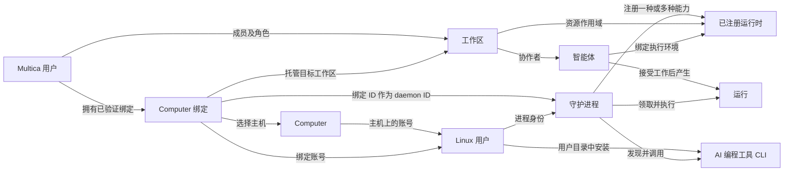

# Computer、Linux 用户与运行时设计

本文整理截至 2026-09-24 的设计，面向开发、review 和自托管运维。文中“工作区”“智能体”“运行时”“守护进程”分别对应 Workspace、Agent、Runtime、Daemon；保留 Computer 和 Admin Area 作为界面及代码入口名称。

相关文档：[修复记录](../engineering/computer-runtime-review-fixes.md)、[部署前置条件与 PAM 操作说明](../../server/internal/computer/README.md)、[产品侧守护进程与运行时说明](../../apps/docs/content/docs/daemon-runtimes.zh.mdx)。

## 1. 概念与职责

| 概念 | 身份与作用域 | 职责与边界 |
| --- | --- | --- |
| Multica 用户（Multica User） | 全局 `user.id` | 登录平台、持有个人凭据、加入工作区、拥有智能体或运行时。用户名或邮箱不决定远端 Linux 用户名。 |
| 工作区（Workspace） | `workspace.id`，成员关系赋予工作区角色 | 承载任务、项目、智能体和已注册运行时。工作区角色不会自动赋予实例管理或 Linux 权限。 |
| Computer | 实例级 `computer.id` | 管理员登记的可通过 SSH 管理的主机，保存名称、地址、端口、SSH operator 和可用状态。注册 Computer 不会自动创建 Linux 用户或运行时。 |
| SSH operator | Computer 的 `ssh_user` | 后端连接主机时使用的运维账号，需要免密 sudo。它负责切换到目标 Linux 用户执行操作，不等同于被开通的用户。 |
| Linux 用户（Linux User） | 主机上的 OS 账号；平台以 `(computer_id, username)` 标识 | 拥有 home、文件权限、工具安装和守护进程进程身份。同名用户在两台 Computer 上是两个账号。 |
| Computer 绑定 | `computer_binding.id` | 把 Computer、Linux 用户、Multica 用户和一个目标工作区联系起来，记录所有权验证及开通状态。 |
| 守护进程（Daemon） | 进程及 `daemon_id` | 在目标 Linux 用户下运行，发现 CLI、向工作区注册运行时、领取运行、执行工具并回传结果。托管路径使用绑定 ID 作为 daemon ID。 |
| 已安装 CLI | Linux 用户环境中的 `codex`、`kimi` 等可执行文件 | 是运行时的本机前置条件；安装成功不等于守护进程已经发现、注册或完成模型认证。 |
| 已注册运行时（Runtime） | 工作区内的 `agent_runtime.id` | 表示某个 daemon 提供的一种执行能力，包含 provider、所有者、在线状态等。一个 daemon 可注册多条运行时。 |
| 自定义运行时配置 | 工作区内的 `runtime_profile.id` | 描述命令、参数和协议族；主机解析到命令后才注册对应实例。配置本身不安装 CLI。 |
| 智能体（Agent） | 工作区内的 `agent.id` | 可重复使用的协作者身份和配置，绑定运行时，持有指令、模型、skill 等设置。它本身不是常驻进程，也不是 Linux 账号。 |
| 运行（Run） | API/数据库中的 `task` | 智能体的一次具体执行。一个智能体可以先后产生多次运行。 |
| Admin Area | 工作区之外的 `/admin` | 实例管理员管理 Computer、查看 Linux User 绑定与审计、检查主机的入口；普通 runtime 安装归用户的“我的运行环境”。 |

### “运行时”的三种界面语境

设置中的“我的运行环境”按用户自己的 Computer 绑定展示 CLI 探测、版本和安装操作。Admin Area 的 Linux Users 只展示绑定状态与故障信息，不提供普通安装入口。

工作区的运行时页面展示的是守护进程注册的 `agent_runtime`。它参与智能体绑定和运行派发，并拥有工作区、所有者、可见性及在线状态。排障时应分别检查 CLI 安装、daemon 进程、运行时注册和智能体执行。

## 2. 对象关系与基数

- 一个 Multica 用户可加入多个工作区，也可持有多个 Computer 绑定。
- 一台 Computer 可供多个 Linux 用户使用；每个用户拥有自己的 home、工具安装和托管 daemon。
- 当前托管方案对 `(computer_id, username)` 建立唯一约束。同一个 OS 账号在平台上只有一条绑定；已验证绑定不能转给其他 Multica 用户。
- 托管绑定在同一时刻关联一个目标工作区。当前实现不支持对同一个 Computer/Linux 用户同时创建多条工作区绑定。同一所有者可在绑定处于 `removed` 或 `detached` 后重新 provision 到另一个工作区。
- 一般的手动/Desktop daemon 可连接多个工作区。不要把托管绑定的单工作区约束推广到所有 daemon。
- 内置运行时按 `(workspace_id, daemon_id, provider)` 注册；自定义配置实例按 `(workspace_id, daemon_id, profile_id)` 注册。同一组合重新注册会更新原记录。
- 一个运行时可承载多个智能体。智能体当前绑定一个运行时；解除绑定后，身份和历史可以继续保留。

例如，Alice 的 Multica 用户在 Computer C 上绑定 Linux 用户 `alice`，目标是工作区 W。该账号安装 Codex 和 Kimi 后，托管 daemon 可在 W 注册两条运行时。W 中的多个智能体可以在授权允许时选择这些运行时；它们无需分别创建 Linux 用户。

Computer 登记不是所有运行时的必经入口。手动连接或 Desktop 启动的 daemon 可以直接注册运行时，无需先在 Admin Area 创建 Computer。工作区运行时页面的机器分组使用 daemon 等运行时信息，不能假定每组都存在对应的 `computer` 记录。

Linux 用户提供 OS 文件权限和进程身份边界；同一账号下的多个智能体并不因此获得彼此独立的 OS 身份。工作区的 API 数据隔离，也不能直接推导成同一 Linux UID 下的文件或凭据隔离。

## 3. 权限模型

实例管理权、工作区管理权、运行时使用权和智能体调用权分别判断。

| 操作 | 授权条件 | 不随之获得的权限 |
| --- | --- | --- |
| 进入 Admin Area，管理 Computer、查看全局绑定和审计 | 已认证的人类用户，且 ID 在实例管理员配置中 | 不自动成为所有工作区的成员，也不通过此页面读取其他人的个人凭据。 |
| 保存个人 Computer 凭据 | 当前 Multica 用户；Multica PAT 必须属于本人且有效 | 工作区 owner/admin 不能通过个人接口读取别人的配置。 |
| 开通或复用 Linux 用户 | 当前用户是目标工作区成员，满足绑定所有权、Linux 账号与密码校验 | 知道用户名不代表可接管已验证绑定。 |
| 同步、升级或移除托管 daemon | 本人的已验证绑定及对应操作校验，仍需 Linux 密码 | 不允许修改其他人的绑定；移除不等于删除 Linux 账号。 |
| 探测或安装 CLI | 当前用户拥有已验证、可用的 Linux User 绑定 | 请求不能指定任意 Linux 用户；Admin Area 不提供 CLI 安装。 |
| 选择运行时创建或迁移智能体 | 运行时有所有者；本人所有，或已公开给所在工作区 | 工作区 owner/admin 不能绕过别人的私有运行时使用限制。 |
| 将运行时设为公开或私有 | 运行时所有者 | 工作区管理员的重命名、删除权限不包含替所有者同意共享。 |
| 管理智能体 | 智能体所有者或工作区 owner/admin，敏感字段另有读取限制 | 管理权限不等于可以调用别人的私有智能体。 |
| 触发智能体运行 | 按智能体 Access 判断：仅自己、整个工作区或指定成员 | 工作区 owner/admin 不绕过调用授权；A2A 链路还需按原始调用人判断。 |

实例管理员由 `MULTICA_INSTANCE_ADMIN_IDS` 配置。只有该变量**未设置**时，才使用 `MULTICA_COMPUTER_OPERATOR_IDS` 作为已有部署的引导配置；显式设置为空不触发该兼容行为。`GET /api/me/instance-access` 为 UI 返回权限信号，真正的授权仍由后端逐接口执行。

Computer 相关路由要求人类身份。普通用户获取机器列表时只需稳定 ID、名称和可用状态；返回的主机地址、端口和 SSH operator 信息被隐藏。用户侧 CLI 安装仍依赖后端持有的 SSH/sudo 运维权限，不能把应用层权限边界理解为隔离主机 root 的安全边界。

智能体 Access 与运行时共享是两次不同的授权：前者决定谁可触发该智能体，后者决定谁可把智能体绑定到该执行环境。公开运行时允许工作区成员选择执行资源，不会直接向成员返回 OS 密码或厂商登录凭据。

## 4. 用户入口与接口

| 入口/接口 | 用途 |
| --- | --- |
| `/admin` | 实例级 Computer、Linux User 绑定和审计管理；不置于 `/{workspaceSlug}` 下。 |
| 个人设置 → 我的运行环境 | 保存个人凭据，选择机器、Linux 用户和工作区，执行开通、同步、升级、移除，并在绑定内管理 CLI。 |
| 工作区的运行时、智能体页面 | 管理已注册执行资源和协作者配置。 |
| `GET /api/computers` | 用户选择可用 Computer；本人已验证绑定的停用机器仍可见，以便清理。 |
| `GET/PUT /api/me/computer-settings` | 本人的加密存储配置，响应禁止缓存。 |
| `GET/POST /api/me/computer-bindings` | 查询本人绑定，或提交 `provision`、`sync`、`upgrade`、`remove` 操作。 |
| `GET/POST /api/admin/computers` | 管理员列出、注册主机；注册前必须通过连接检查。 |
| `PATCH/DELETE /api/admin/computers/{id}` | 更新或删除主机，受已有绑定限制。 |
| `POST /api/admin/computers/check` | 检查草稿连接，不保存机器或检查结果。 |
| `POST /api/admin/computers/{id}/check` | 检查已注册机器，保存结果并尝试写入审计。 |
| `GET /api/admin/computer-ssh-pubkey` | 返回后端 SSH 公钥，供管理员配置目标主机；不返回私钥。 |
| `GET /api/me/computer-bindings/{id}/runtimes` | 在本人可用绑定的 Linux User 环境中探测 CLI 版本。 |
| `POST /api/me/computer-bindings/{id}/runtime-install` | 在本人可用绑定中，以 `runtime_id` 和 `version` 安装或更新 CLI。 |
| `GET /api/admin/computer-bindings`、`GET /api/admin/computer-audit` | 管理员查看跨用户的绑定元数据和操作记录。 |
| `POST /api/admin/computer-bindings/{id}/check` | 管理员检查绑定的 Linux 账号是否仍存在。 |

用户侧 CLI 接口从绑定解析目标 Linux 用户，不接受请求传入的用户名。

## 5. 绑定与开通生命周期

### 5.1 提交与账号判定

1. 用户先保存自己的 Git 身份、Git 凭据、模型环境变量和 Multica PAT。后端验证 PAT 所属用户。
2. 用户提交 Computer、Linux 用户名、目标工作区、Linux 密码和操作类型。
3. 后端检查工作区成员、个人配置和绑定权限，在事务中占用唯一绑定并置为 `running`，返回 HTTP 202。202 仅表示操作已接受。
4. 后台作业在 `(Computer, username)` 文件锁内执行账号判定；锁和失败次数存于 `MULTICA_COMPUTER_STATE_DIR`。
5. Linux 账号不存在时创建账号；已存在时通过固定 PAM 策略验证密码及账号资格。复用账号不会重置密码。系统账号、SSH operator 和有特权的账号不能按普通用户复用。
6. 密码明确不匹配才计入失败次数；基础设施错误退回预占次数。默认五次失败触发 15 分钟锁定，拒绝期间的请求不延长锁定。

未验证且失败的占位记录允许其他用户重新尝试，但仍必须通过 Linux 校验。已验证所有权在后续失败、移除 daemon 后继续保留。

### 5.2 新账号初始化与回滚

顺序为：安装系统包 → `useradd` 使用已安装的 zsh → `chpasswd` → 安装 oh-my-zsh → 写个人配置 → 安装并启动托管 daemon。

- 当前支持 Debian/Ubuntu 的 `apt-get` 路径，系统包包括 zsh、htop、curl、git。连接检查验证工具存在，不保证包仓库、网络或软件源可用。
- apt 失败发生在 `useradd` 之前，无账号可删除。密码或 oh-my-zsh 初始化失败时，创建脚本尝试删除刚建的账号。
- `CreateUser` 成功后，写配置或安装 daemon 失败由外层流程补偿删除新账号。复用的既有账号不走该删除补偿。
- apt 和 oh-my-zsh 各有 120 秒进程组执行预算，超时先发送 SIGTERM，再清理残留进程；建号 SSH 预算至少 8 分钟。
- 当前工具初始化仍属于开通成功的必要条件，没有实现“账号已建好、增强工具以后重试”的独立状态。
- 这些补偿不保证在主机断电、进程被 SIGKILL 或回滚命令自身失败时原子恢复。失败后须核对实际账号和进程状态。

### 5.3 守护进程与就绪条件

托管 daemon 使用绑定专属的二进制目录和 CLI profile：

| 位置/标识 | 用途 |
| --- | --- |
| `/opt/multica-computers/<binding-id>/multica` | 后端上传的受控 Multica CLI 二进制。 |
| `$HOME/.multica/profiles/computer-<binding-id>/config.json` | 个人 PAT、服务地址、工作区和健康端口配置。 |
| `$HOME/.multica/profiles/computer-<binding-id>/workspaces` | 此 profile 的本地执行目录根路径；不等于平台 Workspace 实体。 |
| `multica-daemon@<username>.service` | 按 OS 用户运行的 systemd unit，选择上述 profile，指定 daemon ID，并关闭自动更新。 |

生成 unit 时读取系统账号的实际 home，支持 home 不位于 `/home/<username>` 的账号。unit 设置 `UMask=0077`，PATH 包含用户的 `.local/bin`、`.kimi-code/bin`、`.grok/bin` 和系统工具目录；systemd 不读取 `.zshrc` 或 nvm 的交互式环境。

启动命令成功还不足以把绑定标为 `ready`。后端最多等待 90 秒，查询是否存在同时满足绑定的 daemon ID、Multica 用户 owner ID、目标 workspace ID、`status=online`、最近 30 秒内心跳的 `agent_runtime`。

需要区分两种状态：绑定的 `ready` 是上次开通/同步/升级的结果；工作区运行时的在线状态来自实时连接和心跳。绑定已经 `ready` 不代表 daemon 此后一直在线。

| 绑定状态 | 含义 |
| --- | --- |
| `pending` | 数据库默认初始值；正常提交操作会写为 `running`。 |
| `running` | 后台操作进行中；禁止并发接管。 |
| `ready` | 操作完成，并通过指定身份的运行时注册检查。 |
| `failed` | 本次操作失败，错误摘要用于用户恢复。 |
| `removed` | 已停止、禁用并移除托管 daemon 的 unit/二进制。 |
| `detached` | 工作区关联已解除，例如工作区删除后的绑定保留状态。 |
| `interrupted` | 查询时对超过 20 分钟未更新的 `running` 记录展示的状态；不是自动完成了远端回滚。 |

`provision`、`sync`、`upgrade` 目前复用账号验证、配置写入和 daemon 安装路径。用户操作会影响对应 daemon 进程，不应把“同步”理解为只写数据库。

## 6. CLI 安装、发现和注册

管理员安装链路为：校验请求 → SSH operator 连接 → `sudo -n runuser -u <linux_user>` → 用户环境中完整下载/安装 → CLI `--version` 校验 → 尝试写审计并返回结果。

| 运行时 ID | 当前安装方式 | 用户内的位置与版本传递 |
| --- | --- | --- |
| `claude` | npm `@anthropic-ai/claude-code` | `~/.local` prefix，包版本为请求的 `version`。 |
| `codex` | npm `@openai/codex` | 同上。 |
| `opencode` | npm `opencode-ai` | 同上。 |
| `pi` | npm `@earendil-works/pi-coding-agent` | 同上。 |
| `omp` | Oh-My-Pi 官方安装器的独立二进制模式 | 明确设置 `PI_INSTALL_DIR=~/.local/bin`，固定版本传 `--binary --ref v<version>`；`latest` 不指定 ref。 |
| `kimi` | Kimi 官方安装器 | 明确设置 `KIMI_INSTALL_DIR=~/.kimi-code`，固定版本用 `--version`；`latest` 不传版本参数。 |
| `grok` | Grok 安装器 | PATH 纳入 `~/.grok/bin`，请求版本作为位置参数；上游约定仍有[验证缺口](../engineering/computer-runtime-review-fixes.md)。 |

npm 安装显式使用 `NPM_CONFIG_PREFIX=$HOME/.local` 和 `--prefix`。目标环境需能找到 Node/npm；仅在 SSH operator 的 nvm 中安装不满足这一条件。npm 的 `latest` 是 dist-tag，审计中记录它时不表示已记录具体解析版本。

`omp` 是独立运行时身份，但复用 `pi` 协议族。`BuiltinRuntimes` 声明这种身份；`ProtocolFamilyInstalls` 为一等协议族提供安装 descriptor。安装表不能改变协议工厂的分派关系。

安装和版本探测使用相同的用户目录集合。daemon unit 也包含这些目录，但已存在的远端 unit 不会随服务端镜像更新自动改写，需要通过“升级运行时”刷新。新增 CLI 后还需让 daemon 重新发现；安装接口本身不重启 daemon，也不完成厂商模型账号登录。

## 7. 凭据、审计和客户端状态

- `computer_credential` 以 Multica 用户为键存放加密配置；解密还检查保存的 owner。数据库密文与 `MULTICA_COMPUTER_SECRET_KEY` 应分别保管。
- Linux 密码只随当前请求进入内存，再通过 SSH stdin 传递，不进入命令参数或数据库。后台作业不是保存密码后可自动重放的持久队列。
- SSH 私钥属于部署侧，目标主机的 host key 需事先验证并写入 `known_hosts`。Git SSH key、Git token、模型环境和 PAT 按用途写入目标用户的配置文件。
- 敏感文件以 0600 写入；托管配置与用户已有配置合并，不以覆盖默认 profile 的方式安装。
- Admin Area 的绑定/审计接口返回操作元数据，不返回个人配置。当前最多展示 500 条绑定和 200 条审计。
- CLI 安装审计使用 `runtime_install:<id>@<requested-version>` 及 `success`/`failure`。它记录请求版本，未存储解析后的实际版本、目标用户名和完整安装日志，不能当作完整的软件资产账本。
- 客户端断开后，安装审计使用独立 5 秒 context 尝试写入；数据库写入失败当前未另行补偿，不能承诺审计绝不丢失。
- Web/Desktop 的服务端数据由 TanStack Query 管理，运行时查询键包含 Multica 用户、Computer 和 Linux 用户。每行有独立安装 mutation，结束后使账号级管理查询失效，包括审计。
- UI 仅在本地保存用户名和版本草稿；用户切换等待 400 ms 后探测。安装期间锁定用户名，防止把一人的操作与另一人的结果混在一起。
- API 响应经过 schema 和兼容解析；未安装、探测失败、列表解析失败与合法空列表分别处理。

## 8. 停用、移除与删除

| 动作 | 当前效果 |
| --- | --- |
| 停用 Computer | 禁止普通用户新的开通、同步和升级；不停止已有进程。本人已验证绑定仍可执行移除。管理员 CLI 安装接口目前未以 `enabled` 作为执行门槛。 |
| 移除托管 daemon | 停止并禁用服务，移除 unit 和绑定专属 CLI 二进制；保留 Linux 用户、代码、个人配置和绑定所有权。 |
| 删除工作区运行时 | 使用工作区运行时删除流程处理智能体依赖，不能用移除 daemon 绕过。 |
| 删除 Computer | 只在不存在任何绑定记录时允许。`removed` 仍是一条绑定，因此“移除 daemon 后就能删除 Computer”不成立；当前没有在此流程中自动清除绑定记录。 |
| 修改 Computer 的连接身份 | 已有任何绑定时拒绝修改 host、port 或 SSH operator，避免把账号关联悄悄指向另一台机器。 |

文件锁只提供单个 bastion 上的跨进程互斥；此方案未实现多个独立 bastion 之间的完整分布式操作协调。CLI 安装与个人绑定后台作业也不构成统一事务。进一步扩展前需要明确部署拓扑、并发操作和远端状态恢复方式。

## 9. 实现索引

| 主题 | 代码 |
| --- | --- |
| 路由与人类身份门禁 | [router.go](../../server/cmd/server/router.go) |
| 实例权限、主机管理、绑定检查、用户侧 CLI 探测/安装 | [instance_admin.go](../../server/internal/handler/instance_admin.go) |
| 个人配置和主机可见性 | [computer.go](../../server/internal/handler/computer.go) |
| 绑定所有权、后台操作、就绪检查 | [computer_binding.go](../../server/internal/handler/computer_binding.go) |
| 账号判定、补偿与远端执行 | [remote.go](../../server/internal/computer/remote.go)、[ssh_remote.go](../../server/internal/computer/ssh_remote.go) |
| unit 和文件写入 | [files.go](../../server/internal/computer/files.go)、[scripts.go](../../server/internal/computer/scripts.go) |
| CLI descriptor 与协议身份 | [builtin_runtimes.go](../../server/pkg/agent/builtin_runtimes.go) |
| 注册键和运行时权限 | [runtime.sql](../../server/pkg/db/queries/runtime.sql)、[runtime.go](../../server/internal/handler/runtime.go) |
| 智能体调用权限 | [agent_access.go](../../server/internal/handler/agent_access.go) |
| 共享管理页面、个人运行环境及查询 | [admin-page.tsx](../../packages/views/admin/admin-page.tsx)、[computers-tab.tsx](../../packages/views/settings/components/computers-tab.tsx)、[admin.ts](../../packages/core/computers/admin.ts) |
